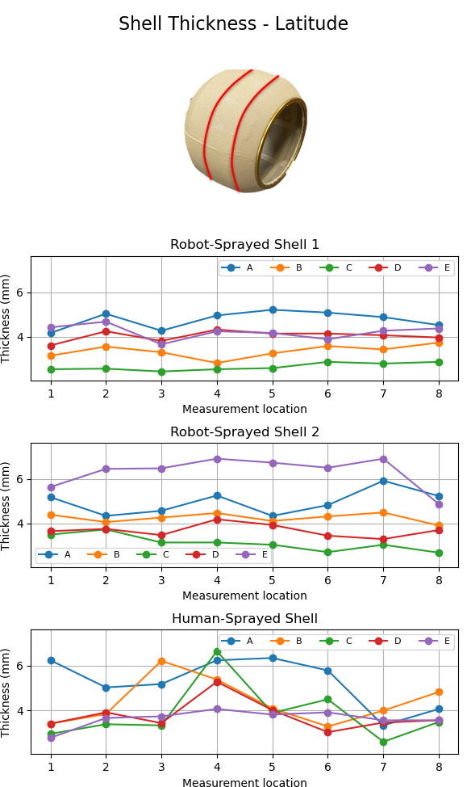
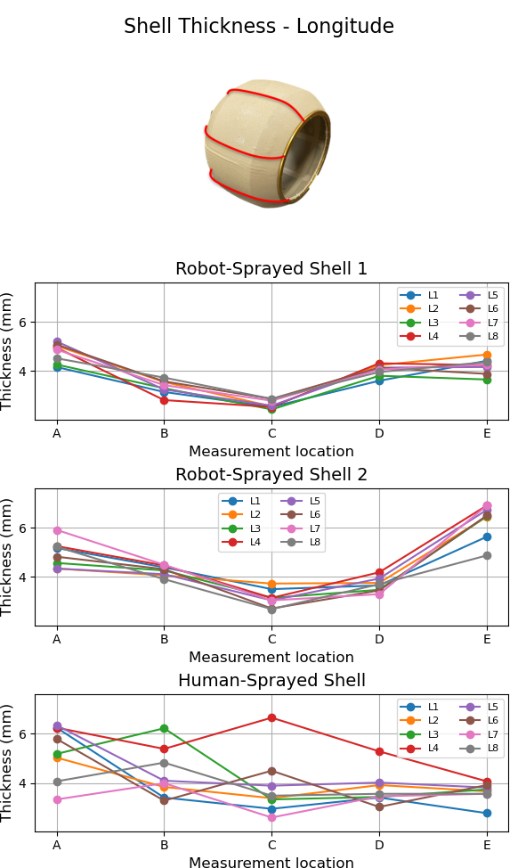
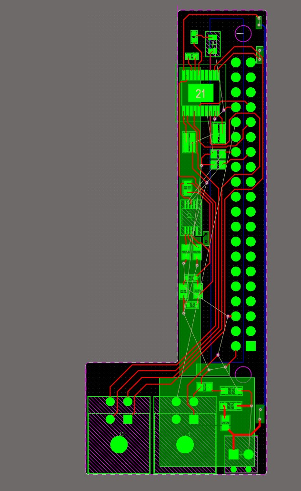
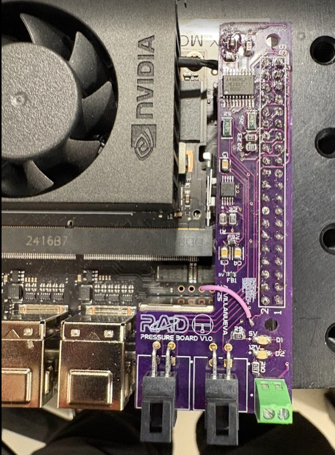

--
# About Me

I'm currently a Research Engineer II at the Texas A&M University Engineering Experiment Station working in the Robotics and Automation Design Lab. I have a B.S. in Mechanical Engineering from the University of California, Irvine. I am aproximately halfway through my part-time aerospace engineering master’s degree at Purdue University, where I am specializing in autonomy and control systems. Previously, I was an Operations Engineer at a robotics startup called Stellar Pizza. Before that, I interned at Tesla, SpaceX, and Northrop Grumman, primarily working on test engineering.

My professional interests lie in robot–environment interaction. As such, many of my projects involve utilizing my understanding of control systems, perception/sensing, localization, and path planning. As I dive deeper into my studies, I am also beginning to utilize optimization-based approaches like model predictive control and graph-based localization.

# Projects

  
Robotic Space Simulator KF/EKF/UKF

  

  
Localization Of Spherical Robot Using ROS2 Package

  
Custom Slope Detection Algorithm

<!--
I worked on slope descent for a spherical robot, focusing on estimating both slope angle and uncertainty. To improve observability, I designed an external, actively actuated time of flight sensor module that continuously points toward the ground.

Due to strict compute and bandwidth constraints, I implemented a Gaussian mixture filter to estimate slope geometry and confidence directly on the sensor module. This allowed the descent controller to adapt its gains based on terrain quality and provided higher-quality inputs to global planners.

Notable Achevements:
+ Implemented real-time Gaussian mixture filtering with aggressive component trimming
+ Derived sensor uncertainty models based on time-of-flight sensor geometry

*Add a powerpoint plot*
*Add the predict and the update steps*
*Add photo of the remora*
*EVENTUALLY add a video of it working*

-->

  
Robot Arm Spraying

Spherical robot shells are manufactured using a spray process. Because this process is typically performed by hand, a lack of shell consistency can lead to control issues, including reduced control authority and increased sensitivity to the drive system. It also resulted in inconsistent control authority and sensitivity between robots.

To improve this process, I replaced manual spraying with a robotic arm–based spraying system. This significantly improved shell consistency, which in turn improved control performance and allowed for the use of a less aggressive controller.

### Notable Achevements:
+ Automated both the spinner and the robot arm using ROS2/C++
+ Derived kinematic equations to achieve different shell thicknesses as a function of spray speed
+ Implemented closed-loop thickness correction using a 3D surface map of the sphere

### Media

<video width="80%" controls>
  <source src="arm_spray.mp4" type="video/mp4">
</video>

*Video of the robot arm spraying*

  
  

*Shell thicknesses along the latitude and longitude of the shell. A much more consistant thickness can be observed in the robot arm sprayed shells.*

*Robotic arm–mounted spray system.*

  
Modular Logging and Networking Systems

  
Automatic Defrost Sequence

  
Pressure Controller

I designed and implemented a general-purpose pressure control system for laboratory use. The system includes a custom PCB and embedded software, and interfaces directly with the 40-pin GPIO header of an NVIDIA Jetson or Raspberry Pi. Once configured, the controller automatically controls a solenoid valve or a compressor to regulate pressure or track a changing setpoint.

### Notable Achievements

+ Designed, documented, and trained lab members on a ROS 2–based pressure controller toolbox
+ Developed a shield board using a shared GPIO pinout to ensure cross-compatibility between Raspberry Pi and NVIDIA Jetson platforms
+ Designed and manufactured the PCB, and implemented the full embedded control software stack

### Media

<video width="30%" controls>
  <source src="pressure.mp4" type="video/mp4">
</video>

*Video of Custom PCB Implementation working via Steam Deck*

*PCB Schematic*

  
  

*PCB Layout and Manufactured PCB on Jetson Orin Nano*

  
Machine Learning Pedestrian Navigation

Foot-mounted inertial navigation systems suffer from rapid drift and sensitivity to motion type, limiting their effectiveness in GPS-denied environments. Classical approaches such as EKF and Zero-Velocity Updates mitigate this drift but rely on fixed thresholds and covariance parameters that vary with activity (standing, walking, running).

In this project, I investigated whether additional IMU data from wearable devices could improve activity classification and enable more adaptive navigation filtering. While prior work typically relies only on a foot-mounted IMU, these tests added in watch mounted and pocket/phone mounted IMU sensors.

I collected and synchronized a multi-IMU dataset (shoe, watch, phone) at 100 Hz across standing, walking, and running trials. A deep LSTM-based classifier was trained on multiple sensor configurations to evaluate the impact of multi-device fusion.

### Notable Achievements
+ Achieved 98% classification accuracy using combined shoe + watch + phone data
+ Outperformed the foot-mounted IMU only baseline (≈95%) using multi-sensor fusion
+ Demonstrated that more inertial sensors provide meaningful information for pedestrian navigation

### Media

