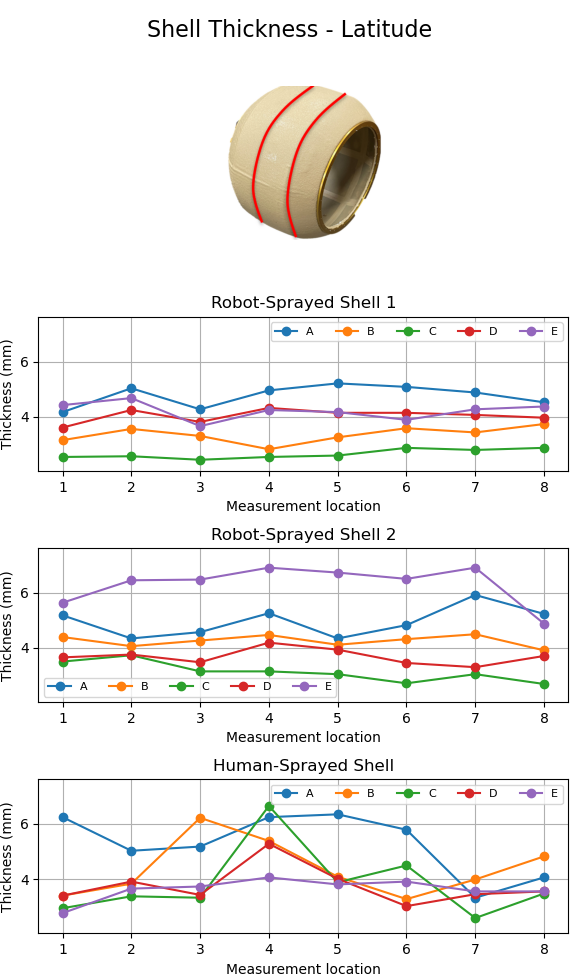
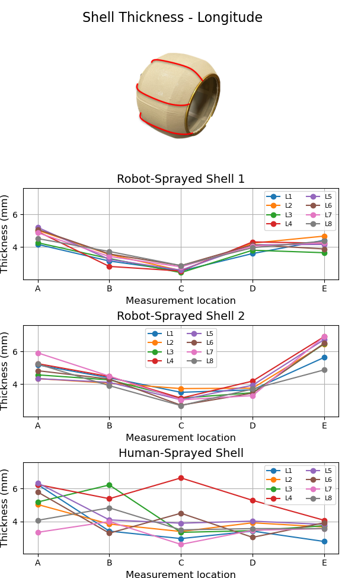
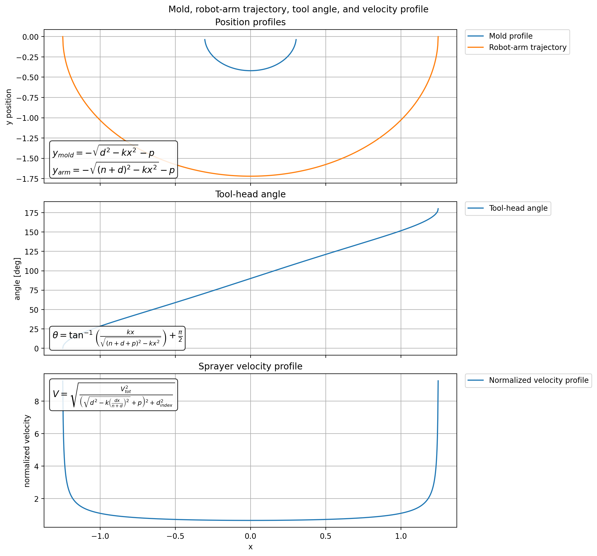
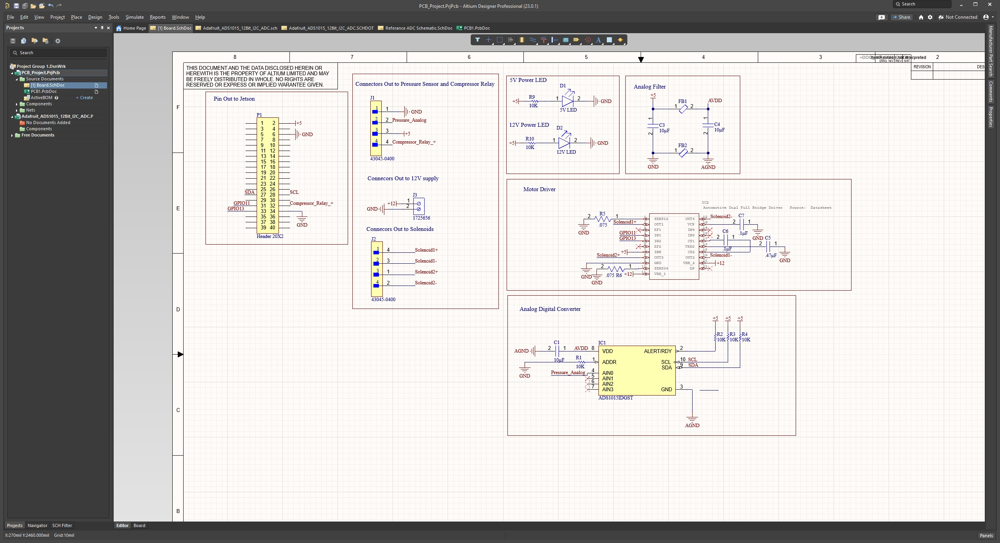
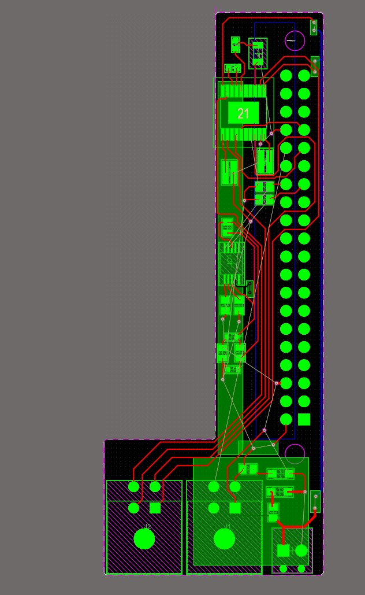
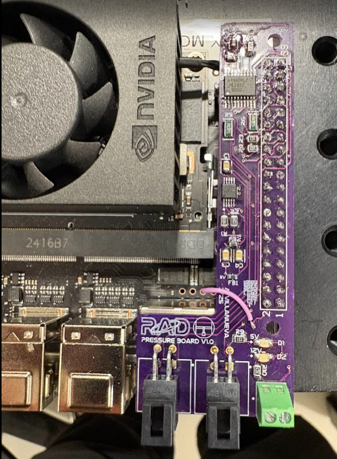

--
# About Me

I'm currently a Research Engineer II at the Texas A&M University Engineering Experiment Station working in the Robotics and Automation Design Lab. I have a B.S. in Mechanical Engineering from the University of California, Irvine. 

I am aproximately halfway through my part-time aerospace engineering master’s degree at Purdue University, where I am specializing in autonomy and control systems. 

Previously, I was an Operations Engineer at a robotics startup called Stellar Pizza. Before that, I interned at Tesla, SpaceX, and Northrop Grumman.

My professional interests are in control systems, perception and sensing, and localization/state estimation. I have experience with system identification, optimal control, classical controls, Kalman filtering, and related methods.

I hope you enjoy looking through my portfolio. I think it demonstrates my ability to get things done quickly and efficiently by leaning on a strong understanding of both the underlying methods and the hardware and software stack.

# Projects

  
Robotic Space Simulator KF/EKF/UKF (WIP) 

  
Jumping Spherical Robots with Optimal Controller 

### Problem Statement

The robot is liable to get stuck in depressions or loose sand, so we needed a way for the 350 lb robot to get itself out.

### What I did

I modeled the robot in 2D, both while airborne and while in contact with the ground.

I built a simulator to optimize the robot’s states over a trajectory and generate a jumping maneuver. I formulated the cost function using Pontryagin’s Minimum Principle.

I compared and studied two trajectory optimization methods: direct collocation and the shooting method.

I then implemented and tuned a reference-tracking LQR controller on the real robot, successfully executing the jump. Much of the reference-tracking LQR implementation and spline-generation work was completed by my fantastic summer intern, David Boosi.

### Notable Achevements
+ Jumped a 350lb 6ft diameter robot 8"-1' in the air (depending on the scenario).

### Some Math

I modeled the robot as an 8-state nonlinear system:

\[
x =
\begin{bmatrix}
x_s & z_s & w & \gamma &
\dot{x}_s & \dot{z}_s & \dot{w} & \dot{\gamma}
\end{bmatrix}^{T}
\]

with nonlinear dynamics:

\[
\dot{x} = f(x,u)
\]

For example, the pendulum dynamics during ground contact are:

\[
\ddot{\gamma}
=
-\frac{1}{I_{eq}}
\left[
m_t u
+
m_t d_\gamma(\dot{\gamma}-\dot{w})
+
m_p r_p F_c \sin(\gamma)
\right]
\]

I formulated trajectory generation as the constrained optimal control problem:

\[
\min_u
\left(x(t_f)-x^\star\right)^T
Q_f
\left(x(t_f)-x^\star\right)
+
\int_{t_0}^{t_f}
\left(
u^T R u + \alpha
\right)\,dt
\]

\[
u_{\min} \leq u \leq u_{\max}
\]

### Media

<video width="80%" controls>
  <source src="swing_up_jump.mp4" type="video/mp4">
</video>

*Video of the robot jumping from flat, unobstructed ground. The controller behaves similarly to a swing-up controller to build momentum then performs a jump optimized for height.*

<video width="80%" controls>
  <source src="static_jump.mp4" type="video/mp4">
</video>

*THIS VIDEO IS NOT AI-GENERATED. The unusual trajectory is caused by the rapidly shifting center of mass of the internal pendulum.*
*Video of the robot jumping while stuck against an obstacle. Video of the robot jumping while stuck against an obstacle. I weighted the trajectory optimization cost to favor both backward jump distance and jump height.*

  
Real Time Localization Of Spherical Robot Using EKF 

### Problem Statement

The robot did not know where it was. We had to demonstrate low level autonomy for a military customer in a little over a month.

### What I did

For quick (around 40Hz) localization of the robot, I used a standard robotic localization package called "ROS2 Robot localization" (https://github.com/cra-ros-pkg/robot_localization). This utilized an EKF and allowed for quick relatively continuous localization for rapid control and pathing decisions using the existing sensor suite.

Because the platform is a non-traditional rover, the standard configuration required significant customization. This included transforming IMU and magnetometer measurements into the Earth frame and incorporating platform-specific dynamics into the estimation pipeline to maintain filter consistency at high update rates.

### Notable Achevements

+ Rapid integration and tuning enabled the team to meet aggressive demonstration deadlines
+ Extended EKF cross-covariance logic to enable water detection as a by-product of state estimation
+ Won a paid research contract with the military customer

### Media

<video width="80%" controls>
  <source src="path_planning_on_the_beach_.mp4" type="video/mp4">
</video>

*Video of path planning on the beach using simple l1 planner enabled by EKF/Robot localization package.*

<video width="80%" controls>
  <source src="ekf_localization.mp4" type="video/mp4">
</video>

*Foxglove Visualization of Robot Localizing in high bay (URDF Missing/low res = needs to be updated)*

  
Global Localization of Robot Using Factor Graphs (WIP) 

### Problem Statement

After completing the EKF based localization (see other tab) the robot could determine it's own location was but it could not tell where other things were in relation to it. Further it had no understanding of slopes. 

### What I did

Assisted in designing waterproof sensor suite including a time of flight sensor and camera for determining ground slope state.

Used kinematics to gain an understanding of the robot's "wheel odometry" based on the ground slope.

Used GTSAM to perform SLAM, integrating with our existing ros2/C++ codebases.

### Notable Achevements

+ Enabled the use of NAV2 navigation and path planning software on the actual hardware (WIP)
+ Kinematics significantly more accurate on slopes, allowing for a graduate student to develop an algorithm to use motor torques to keep the ball level on the slope.
+

  
<strong>View code snippet</strong>

~~~cpp
clc
clear

syms alpha1 alpha2 phi phi_dot psi_dot R omega

% NOTE: ROBOT FRAME NOT EXPRESSED THE SAME WAY IN THE CODE BECAUSE LOCALIZATION WANTS THE TRANSFORM
% EXPRESSED IN ROBOT FRAME. To express it in this way that the code expresses
% it, use phi = 0; This accounts for the non-holonomic motion of
% the robot by altering ground_frame, robot_frame, and
% ball_rotation_inertial_frame as necessary.

% roration of the robot based on phi
robot_frame = [1 0 0;
        0 cos(phi) sin(phi); 
        0 -sin(phi) cos(phi)];
% ground frame rotates robot_frame->world_frame
ground_frame = [cos(alpha1)    sin(alpha1)*sin(alpha2)   sin(alpha1)*cos(alpha2); 
                            0              cos(alpha2)               -sin(alpha2);
                            -sin(alpha1)  cos(alpha1)*sin(alpha2)   cos(alpha1)*cos(alpha2)];

%ball rotation inertial frame
ball_rotation_inertial_frame = [phi_dot; (psi_dot * sin(phi)) + omega; psi_dot * cos(phi)];

%flat to center represented in ground surface frame
rb_c = [0; 0; R];

%3dof linear velocity expressed before ground transform (no slope)
linear_velocity_no_slope =  cross(robot_frame.'*ball_rotation_inertial_frame, rb_c);
linear_velocity_no_slope = simplify(linear_velocity_no_slope)

%3dof linear velocity expressed after transform to world frame (slope)
linear_velocity_slope = ground_frame.'* cross( robot_frame.'*ball_rotation_inertial_frame, rb_c);
linear_velocity_slope = simplify(linear_velocity_slope)

%% yaw measurment calc
syms phi

%Our code disregards the shell roll (phi_dot) in the EKF algo. We instead create a different
%frame for roll. This helps simplify the urdf among other things.
phi_dot = 0;

%basic ackerman yaw rate calc
rpy_vel_no_slope = [0;phi_dot; -omega*sin(phi)];

rpy_vel_slope = ground_frame.'*rpy_vel_no_slope;
~~~

*Click above to see MATLAB code snippet detailing how I obtained the kinematics for a spherical robot on a slope.*

  
Robot Arm Spraying

### Problem Statement

Spherical robot shells are manufactured using a spray process. Because this process is typically performed by hand, a lack of shell consistency can lead to control issues, including reduced control authority and increased sensitivity to the drive system. It also resulted in inconsistent control authority and sensitivity between robots.

### What I did

To improve this process, I replaced manual spraying with a robotic arm–based spraying system. This significantly improved shell consistency, which in turn improved control performance and allowed for the use of a less aggressive controller.

### Notable Achevements:

+ Automated both the spinner and the robot arm using ROS2/C++
+ Derived kinematic equations to achieve different shell thicknesses as a function of spray speed
+ Implemented closed-loop thickness correction using a 3D surface map of the sphere

### Media

<video width="80%" controls>
  <source src="arm_spray.mp4" type="video/mp4">
</video>

*Video of the robot arm spraying*

  
  

*Shell thicknesses along the latitude and longitude of the shell. A much more consistant thickness can be observed in the robot arm sprayed shells.*

*Robotic arm–mounted spray system.*

*Robotic arm equation that accounts for the circular shape of the mold while maintaining index distance. (Hint: requires changing speed of spinner and tool independently!)*

  
Pressure Controller

### Problem Statement

A general pressure control system was needed in the lab. Here were some of the projects that requested such a thing:

+ Inflate and deflate shperical inflatable rover (shown in my other projects)
+ Blow mars and lunar regolith simulant into custom motors for extended period of time
+ Cycle testing of robot that uses inflatable baloon

### What I did

I designed and implemented a general-purpose pressure control system for laboratory use. The system includes a custom PCB and embedded software, and interfaces directly with the 40-pin GPIO header of an NVIDIA Jetson or Raspberry Pi. Once configured, the controller uses a custom ROS2 Interface to controll a solenoid valve or a compressor to regulate pressure or track a changing setpoint.

### Notable Achievements

+ Designed, documented, and trained lab members on a ROS 2–based pressure controller toolbox
+ Developed a shield board using a shared GPIO pinout to ensure cross-compatibility between Raspberry Pi and NVIDIA Jetson platforms
+ Designed and manufactured the PCB, and implemented the full embedded control software stack

### Media

<video width="30%" controls>
  <source src="pressure.mp4" type="video/mp4">
</video>

*Video of Custom PCB Implementation working via Steam Deck*

*PCB Schematic*

  
  

*PCB Layout and Manufactured PCB on Jetson Orin Nano*

